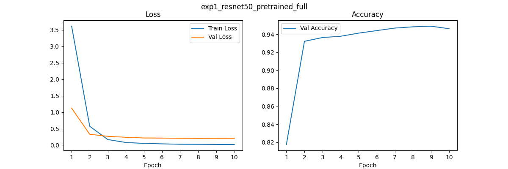
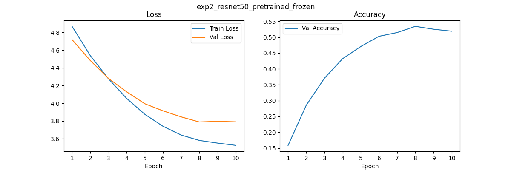
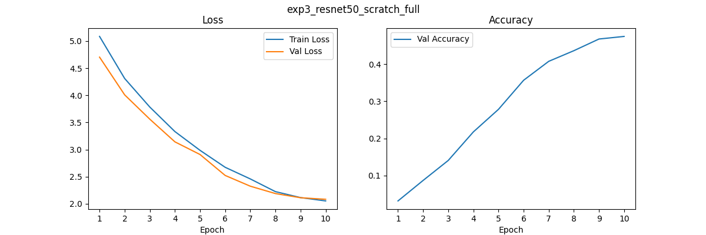
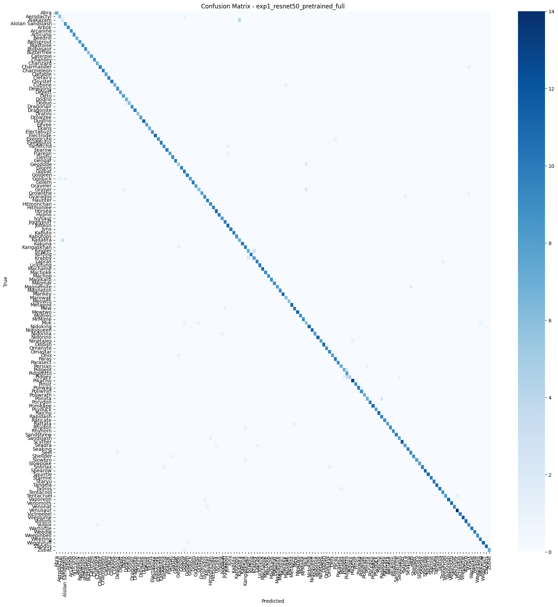
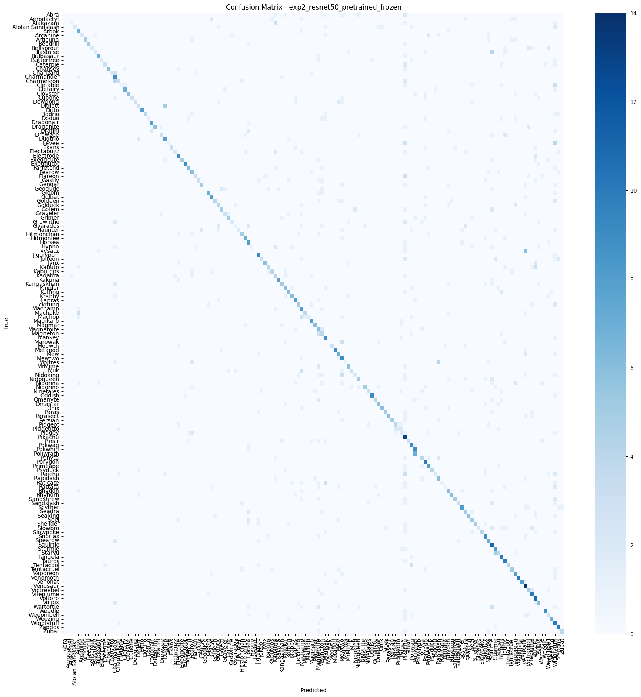
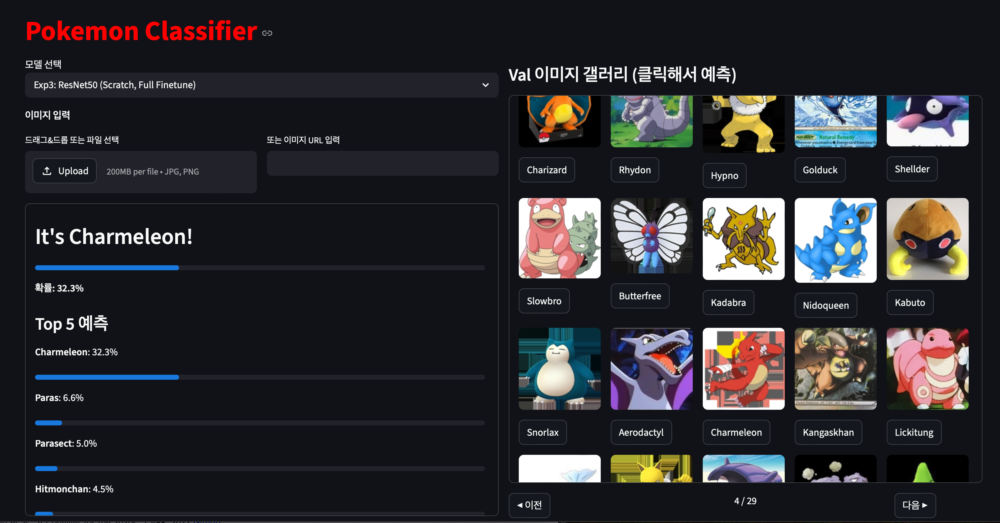

# Pokemon Classification — Transfer Learning 실험

ResNet50 / ConvNeXt-Base를 이용한 전이학습 전략별 포켓몬 분류 성능 비교 실험입니다.

---

## 시작하기

### 데이터 준비
데이터셋은 Kaggle에서 다운로드 후 `data/PokemonData/` 경로에 위치시켜주세요.

👉 [Pokemon Classification Dataset (Kaggle)](https://www.kaggle.com/datasets/lantian773030/pokemonclassification)

### 모델 가중치
Exp1~3은 일반 git, **Exp4(ConvNeXt-Base, 335MB)는 Git LFS**로 관리됩니다.
LFS가 설치되지 않은 경우 아래를 먼저 실행해주세요:

```bash
git lfs install
git lfs pull
```

---

## 데이터셋

- **출처**: kaggle
- **클래스 수**: 150개 (1세대 포켓몬)
- **분할**: Train 80% / Val 20%
- **Val 샘플 수**: 약 1,430장
- **입력 크기**: 224 × 224

---

## 실험 구성

| 실험 | Backbone | Pretrained | Finetune | Epochs | Batch | LR |
|------|----------|-----------|----------|--------|-------|----|
| Exp1 | ResNet50 | ✅ ImageNet | Full | 10 | 32 | 1e-4 |
| Exp2 | ResNet50 | ✅ ImageNet | Frozen | 10 | 32 | 1e-4 |
| Exp3 | ResNet50 | ❌ Scratch | Full | 10 | 32 | 1e-4 |
| Exp4 | ConvNeXt-Base | ✅ ImageNet | Full | 10 | 32 | 1e-4 |

---

## 성능 결과

| 실험 | Val Accuracy | Macro F1 |
|------|:---:|:---:|
| Exp1 — ResNet50, Pretrained, Full Finetune | **94.9%** | **0.946** |
| Exp2 — ResNet50, Pretrained, Frozen        | 53.4% | 0.513 |
| Exp3 — ResNet50, Scratch, Full Finetune    | 47.5% | 0.438 |
| Exp4 — ConvNeXt-Base, Pretrained, Full Finetune | TBD | TBD |

---

## Learning Curve

### Exp1 — ResNet50, Pretrained, Full Finetune



| Epoch | Val Acc |
|-------|---------|
| 1 | 81.7% |
| 5 | 94.1% |
| 10 | 94.9% |

- 1 epoch만에 81.7% 도달 → 사전학습 피처의 강력한 전이 효과
- train/val loss가 안정적으로 수렴, 오버피팅 없음

### Exp2 — ResNet50, Pretrained, Frozen



| Epoch | Val Acc |
|-------|---------|
| 1 | 15.9% |
| 5 | 47.1% |
| 10 | 51.9% |

- 분류층만 학습하므로 loss 감소폭이 매우 작음 (4.87 → 3.53)
- epoch 8 (53.4%) 이후 소폭 감소 → 이미 수렴

### Exp3 — ResNet50, Scratch, Full Finetune



| Epoch | Val Acc |
|-------|---------|
| 1 | 3.1% |
| 5 | 27.8% |
| 10 | 47.5% |

- train loss와 val loss가 나란히 감소 → 오버피팅 없음, 언더피팅 상태
- 10 epoch에서도 계속 상승 중 → epoch을 더 늘리면 추가 향상 가능성 있음

---

## 분석

### Exp1 vs Exp2 — Full Finetune vs Frozen

| | Exp1 (Full) | Exp2 (Frozen) |
|--|:--:|:--:|
| Val Accuracy | **94.9%** | 53.4% |
| Train Loss 감소 | 3.614 → 0.019 | 4.869 → 3.526 |

사전학습 가중치를 사용하더라도 backbone을 고정하면 성능이 **41.5%p** 하락합니다.
ResNet50의 피처가 ImageNet(자연 이미지) 기준으로 학습되어 있어, 포켓몬 도메인에 완전히 적응하려면 backbone까지 함께 fine-tuning해야 효과적입니다.
Exp2는 분류층만 학습하므로 loss 감소폭 자체가 제한적이고, 빠르게 수렴합니다.

### Exp1 vs Exp3 — Pretrained vs Scratch

| | Exp1 (Pretrained) | Exp3 (Scratch) |
|--|:--:|:--:|
| Val Accuracy | **94.9%** | 47.5% |
| Epoch 1 Val Acc | 81.7% | 3.1% |

Pretrained 모델은 epoch 1부터 81.7%를 기록하는 반면, Scratch는 3.1%에서 시작합니다.
ImageNet 사전학습을 통해 에지, 텍스처, 형태 등 저수준 피처가 이미 학습되어 있어, 포켓몬처럼 데이터가 적은 도메인에서도 빠르게 수렴합니다.
Exp3는 10 epoch 기준으로도 아직 수렴하지 않아 더 많은 epoch이 필요하며, 클래스별 성능 편차도 큽니다 (F1: 0.00 ~ 0.94).

### Exp1 vs Exp4 — ResNet50 vs ConvNeXt-Base

| | Exp1 (ResNet50) | Exp4 (ConvNeXt-Base) |
|--|:--:|:--:|
| Val Accuracy | 94.9% | TBD |
| Macro F1 | 0.946 | TBD |

*(Exp4 학습 완료 후 업데이트 예정)*

---

## 앱 테스트 관찰

metrics 수치와 더불어 실제 앱으로 이미지를 넣어봤을 때 발견한 특징입니다.

### Exp1 — 전반적으로 높은 confidence
- 대부분 이미지에서 top-1 확률이 **70~99%** 수준으로 높게 나옴
- F1=0인 클래스가 없어 완전히 엉뚱한 예측이 드묾

### Exp2 — 전반적으로 낮은 confidence
- 맞는 클래스를 예측하더라도 top-1 확률이 **2~10%** 수준으로 매우 낮음
- 150개 클래스에 확률이 고르게 분산되는 경향
- 원인: backbone이 ImageNet 피처 그대로 고정되어 포켓몬 특징을 충분히 구분하지 못함
- val accuracy 53.4%임에도 앱에서 체감 성능이 더 낮게 느껴지는 이유

### Exp3 — 클래스별 confidence 편차가 큼
- 어떤 이미지는 **80%+**, 어떤 이미지는 **15~20%** 수준으로 편차가 심함
- 잘 맞히는 클래스: Weepinbell, Oddish, Electrode 등 시각적으로 뚜렷한 포켓몬
- 전혀 못 맞히는 클래스: Abra, Alakazam, Arbok 등 외형이 유사한 진화 라인 (F1: 0.00)
- 원인: 데이터가 적은 상태에서 scratch 학습 시 특징이 뚜렷한 클래스만 선택적으로 학습됨
- train/val loss가 거의 같이 내려가므로 오버피팅이 아닌 **클래스별 학습 불균형**

---

## Confusion Matrix

| Exp1 | Exp2 | Exp3 |
|------|------|------|
|  |  |  |

---

## 데모 GUI

Streamlit 기반 데모 앱을 제공합니다.



**주요 기능**
- 4가지 실험 모델 선택 가능 (Exp1~4)
- 테스트 이미지 입력 방법 3가지
  - 파일 업로드 (jpg, jpeg, png)
  - 이미지 URL 입력
  - Val 갤러리에서 클릭
- Top-5 예측 결과 및 확률 시각화
- Val 이미지 갤러리 (페이지네이션)

```bash
uv run streamlit run app.py
```

---

## 실행 방법

```bash
# 학습 (전체 실험)
uv run python train.py

# 특정 실험만
uv run python train.py exp1

# 앱 실행
uv run streamlit run app.py
```
